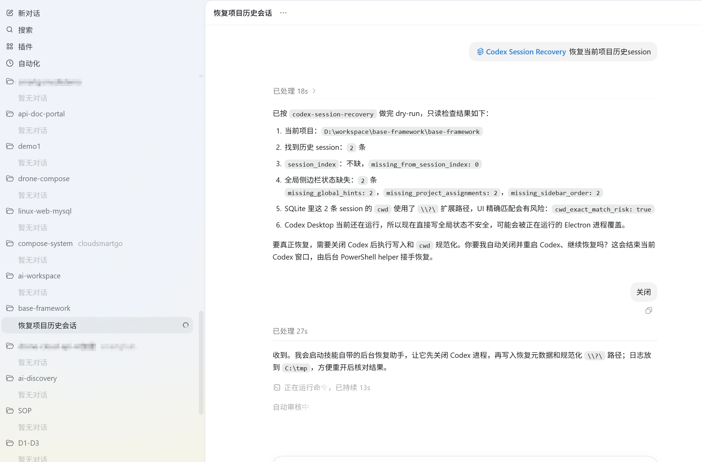
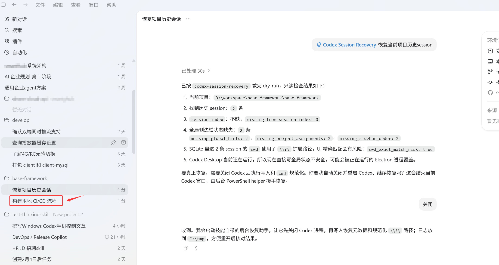

# Codex Session Recovery Skill

[English](README.md) | [中文](README.zh-CN.md)

Codex Session Recovery Skill 是一个非官方的 Codex Desktop 历史会话恢复流程，用于处理 Codex 更新后项目历史 Session 消失的问题。

它面向的典型情况是：历史 Session 数据仍然存在于本地磁盘上，但新版 Codex UI 因为本地索引、项目映射、侧边栏状态、SQLite `cwd` 字段或 Windows 路径格式不匹配，无法把旧会话显示出来。

Codex Desktop 26.527 还存在一种侧栏 hydration 问题：历史会话置顶后能显示，取消置顶后本次运行也能回到项目里，但重启后又消失。当前技能已加入有界轮询的侧栏 surfacing 修复，会同时更新 JSONL rollout 的完成时间、SQLite 排序字段和全局项目映射，并写入备份，避免 app-server 重启 read-repair 后把 SQLite-only 修复打回原形。UI 恢复时优先使用 `--per-project 2 --max-total 50` 这类首屏种子；全量 metadata 归一化仍可能让会话很多的项目挤占前 50 条，导致小项目再次看起来为空。

如果某个项目已经显示 1-2 条，但需要显示更多历史会话，使用定向 surfacing，例如 `--project-root "D:\workspace\ai-workspace\linux-web-mysql" --per-project 10 --max-total 10`。定向 surfacing 不会删除其它 session，但如果对单个项目设置 50 这种大值，它可能挤占 Codex Desktop 首屏 recent 50 条，让其它项目重启后又看起来为空。要继续显示同一项目的下一批历史，不要一次性设置 50，可以加 `--offset-per-project 10`，后续再用 20、30 这样的 offset 分页推进。

这个仓库打包了 `codex-session-recovery` skill 和配套恢复脚本，方便通过 Codex Skills 安装和复用。

## 解决什么问题

Codex Desktop 更新后，部分用户可能遇到这些现象：

- 项目历史聊天记录消失。
- 项目侧边栏不显示旧会话。
- 本地 `sessions/**/*.jsonl` 文件还在。
- `state_5.sqlite` 里还能查到旧 threads。
- Windows 或 WSL 路径迁移后，旧 Session 和当前项目 root 对不上。
- `\\?\D:\repo\project` 和 `D:\repo\project` 指向同一个目录，但在 UI 字符串过滤里不是同一个值。

这种情况下，数据不一定被删除了。

更常见的问题是：新版 Codex UI 通过当前索引、项目映射或精确 `cwd` 查询时，找不到旧数据。

## 截图

Skill 使用截图：dry-run 阶段先发现本地历史 Session、缺失的侧边栏/项目元数据，以及 Windows `cwd` 精确匹配风险。



恢复成功截图：修复元数据并规范化路径之后，历史项目会话重新出现在 Codex Desktop 中。



## 安全策略

这个 skill 的恢复流程偏保守：

- 先 dry-run 审计，不直接写入。
- 优先按项目 root 精确匹配 Session。
- 不删除 Session 文件。
- 写入前创建带时间戳的备份。
- 修改 global state 前检查 Codex 是否正在运行。
- 只在恢复流程需要时规范化 Windows 扩展路径。
- 恢复后重新校验 missing 元数据是否归零。

这不是 OpenAI 官方修复，而是在官方问题解决前的非官方本地恢复方案。

## 安装

使用 Skills CLI 安装：

```bash
npx skills add https://github.com/huajiexiewenfeng/codex-session-recovery --skill codex-session-recovery
```

列出仓库中的可用 skills：

```bash
npx skills add https://github.com/huajiexiewenfeng/codex-session-recovery --list
```

## Codex 使用示例

安装后，可以直接用自然语言让 Codex 执行恢复流程：

```text
使用 codex-session-recovery 恢复当前项目消失的历史 session。
```

```text
Codex Desktop 更新后我的项目历史会话不见了。请先 dry-run 审计并展示报告。
```

```text
修复当前项目的 Codex session 元数据，写入前备份，恢复后验证 missing_* 是否归零。
```

## 直接运行脚本

在仓库根目录执行 dry-run 审计：

```bash
python -B skills/codex-session-recovery/scripts/restore_codex_project_sessions.py --project-root "D:\path\to\project"
```

确认报告后写入恢复：

```bash
python -B skills/codex-session-recovery/scripts/restore_codex_project_sessions.py --project-root "D:\path\to\project" --write --normalize-windows-extended-paths
```

规范化同一项目 root 下的 Windows `\\?\` 路径不匹配：

```bash
python -B skills/codex-session-recovery/scripts/reparent_codex_sessions.py --old-root "D:\path\to\project" --new-root "D:\path\to\project" --write
```

为 Codex Desktop 侧栏生成均衡的首屏种子：

```bash
python -B skills/codex-session-recovery/scripts/surface_codex_sidebar_threads.py --per-project 2 --max-total 50 --write
```

按页为单个项目显示更多会话。这个方式绕开 UI 启动时只取前 50 条 recent cache 的限制，同时避免一次性把其它项目挤出首屏：

```bash
python -B skills/codex-session-recovery/scripts/surface_codex_sidebar_threads.py --project-root "D:\workspace\ai-workspace\linux-web-mysql" --per-project 10 --max-total 10 --write
python -B skills/codex-session-recovery/scripts/surface_codex_sidebar_threads.py --project-root "D:\workspace\ai-workspace\linux-web-mysql" --offset-per-project 10 --per-project 10 --max-total 10 --write
```

当 Codex Desktop 需要先退出才能安全恢复时，使用 Windows helper：

```powershell
$skill = "skills\codex-session-recovery"
Start-Process -FilePath "C:\Windows\System32\WindowsPowerShell\v1.0\powershell.exe" -ArgumentList @("-NoProfile","-ExecutionPolicy","Bypass","-File","$skill\scripts\run_recovery_after_codex_exit.ps1","-ProjectRoot",(Get-Location).Path,"-LogPath","C:\tmp\codex-session-recovery.log","-StopCodexFirst") -WindowStyle Hidden
```

如果隐藏 helper 没有生成日志，并且 Codex 进程仍然存在，改用 UAC 管理员 helper：

```powershell
$skill = "skills\codex-session-recovery"
$script = "$skill\scripts\run_recovery_after_codex_exit.ps1"
$root = (Get-Location).Path
$log = "C:\tmp\codex-session-recovery-uac.log"
$args = "-NoProfile -ExecutionPolicy Bypass -File `"$script`" -ProjectRoot `"$root`" -LogPath `"$log`" -StopCodexFirst"
Start-Process -FilePath "C:\Windows\System32\WindowsPowerShell\v1.0\powershell.exe" -ArgumentList $args -Verb RunAs -WindowStyle Normal
```

## 恢复报告字段

关键 dry-run 和验证字段：

| 字段 | 含义 |
| --- | --- |
| `exact_project_sessions` | 元数据精确匹配项目 root 的 Session 数量 |
| `missing_from_session_index` | `session_index.jsonl` 中缺失的 Session 数量 |
| `missing_global_hints` | global workspace root hints 中缺失的 Session 数量 |
| `missing_project_assignments` | project assignment 状态中缺失的 Session 数量 |
| `missing_sidebar_order` | sidebar project order 中缺失的 Session 数量 |
| `sqlite_exact_ui_cwd_threads` | SQLite 中 `cwd` 精确匹配 UI 项目 root 的 threads |
| `sqlite_non_exact_ui_cwd_threads` | 与项目相关但不是精确 UI cwd 匹配的 threads |
| `sqlite_extended_path_threads` | 使用 Windows `\\?\` 扩展路径的 threads |
| `cwd_exact_match_risk` | UI 是否可能因为 `cwd` 字符串不一致而隐藏 threads |

## 成功标准

不要只把“脚本执行结束”当成恢复成功。

真正的恢复完成，应该验证：

- `missing_from_session_index: 0`
- `missing_global_hints: 0`
- `missing_project_assignments: 0`
- `missing_sidebar_order: 0`
- `cwd_exact_match_risk: false`

如果这些字段都正常，但 UI 仍然不显示历史，需要继续检查 UI 当前 project root 是否和 Session `cwd` 完全一致，包括 Git 根目录和子目录不一致的问题。

## 相关上游 Issue

一些相关的 Codex Desktop 历史会话消失反馈：

- https://github.com/openai/codex/issues/20741
- https://github.com/openai/codex/issues/22796
- https://github.com/openai/codex/issues/23193
- https://github.com/openai/codex/issues/23979
- https://github.com/openai/codex/issues/24364

## 验证

验证 skill 元数据：

```bash
python C:\Users\admin\.codex\skills\.system\skill-creator\scripts\quick_validate.py skills/codex-session-recovery
```

验证本地 Skills CLI 是否能发现这个 skill：

```bash
npx skills add . --list
```

## 许可证

MIT
